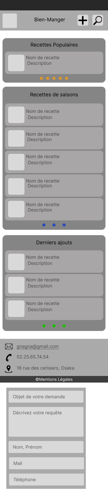
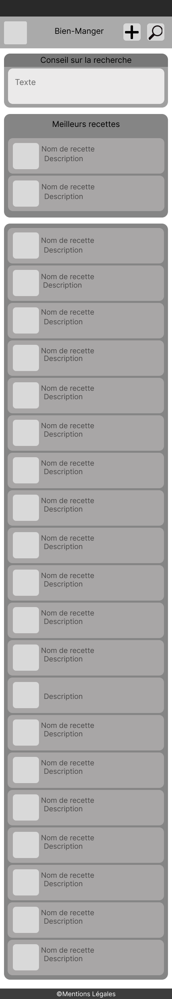
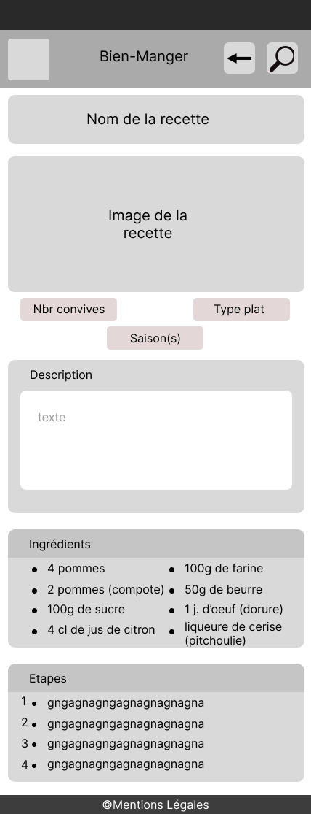
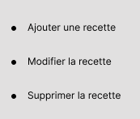
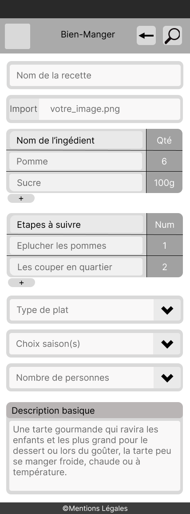
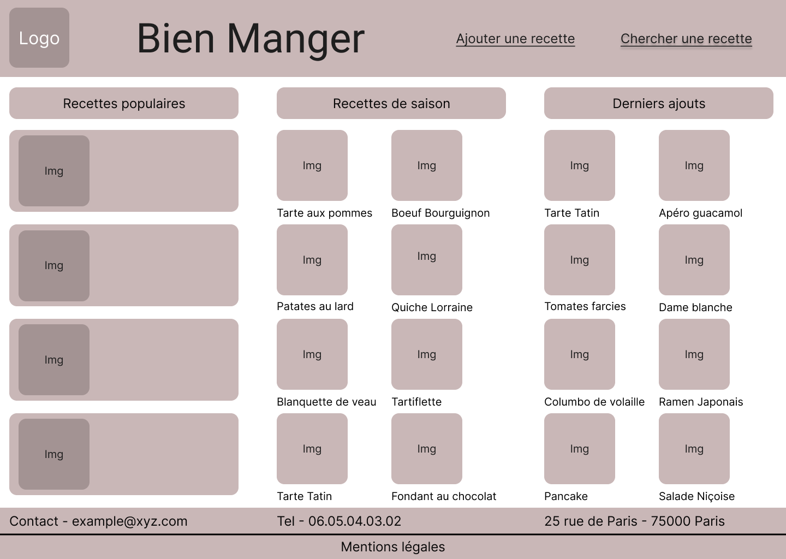
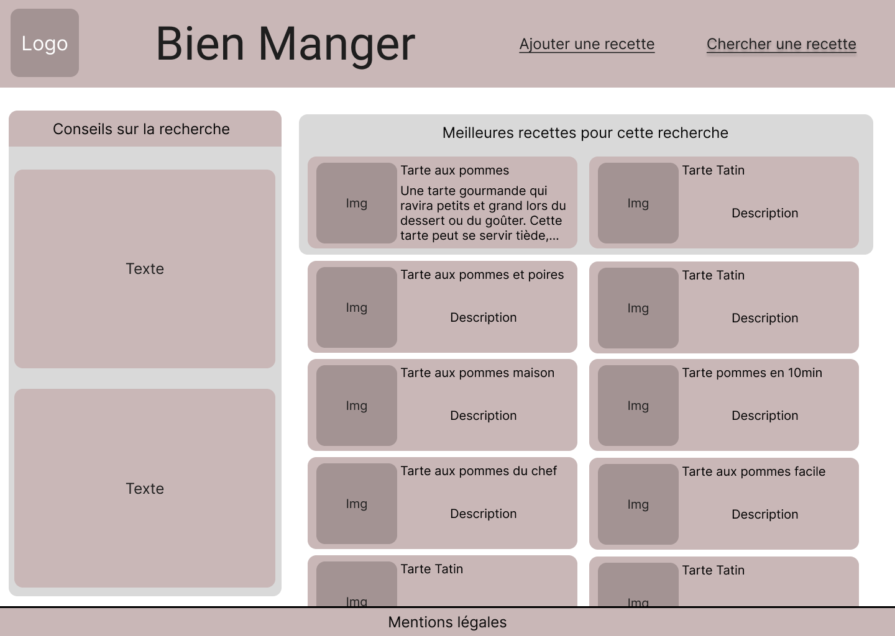
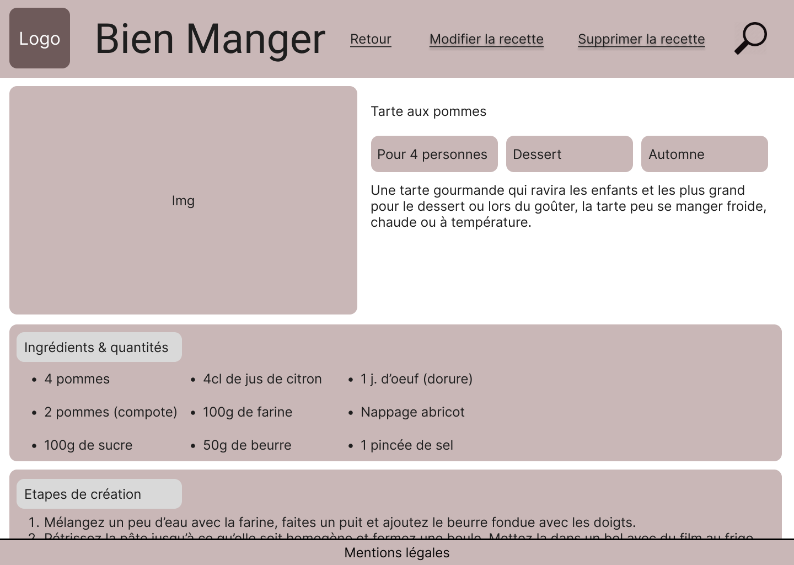
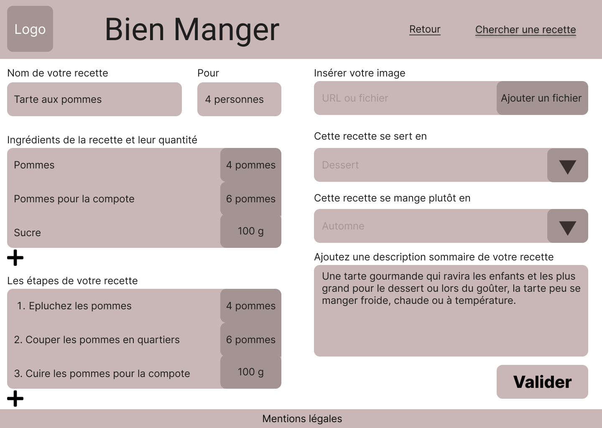

# bien-manger

## Description
```
Ce pojet consiste à créer un site internet contenant des recettes de cuisine.
Le but étant de le façonnerde mannière à se que sont interface soit facile d'utilisation. Une barre de recherche est mis à disposition pour naviger entre les différentes recettes en y indiquant soit un ingrédients soit un #Tag ou simplement le nom de la recette souhaitée.

Nous pourrons retrouver dans les pages recettes leurs ingredients, sa description sommaire, les différentes étapes à suivre et la saison à laquel elle est associée. L'utilisateur lui même aura la posibilité d'en ajouter une dans la base de donnée du site, grace à une page dédiée.
```

### Outils utilisés
```
Pour se projet nous avons utilisés:

-Visual Studio Code: version ->

-Node: version -> 16.17.0

-VueJS: version -> 3

-Bootstrap: version -> 5.2.0

-Base de donnée MySql: version -> 5.7.36

-mysql2: version -> 2.3.3 ou plus

-Sequelize: version -> 6.21.24 ou plus

-TypeScript: version -> 4.7.4 ou plus

```

### Maquettes figma
>Maquette version Smartphone


------------------------------------

------------------------------------


------------------------------------


____________________________________________________
>Voici la version Ordinateur


------------------------------------

------------------------------------

------------------------------------



### Customize configuration
See [Configuration Reference](https://cli.vuejs.org/config/).


### Créateur
 
-Jean-Yves Rousseau

-Julien Lechevalier

-Kenneth Gohin
